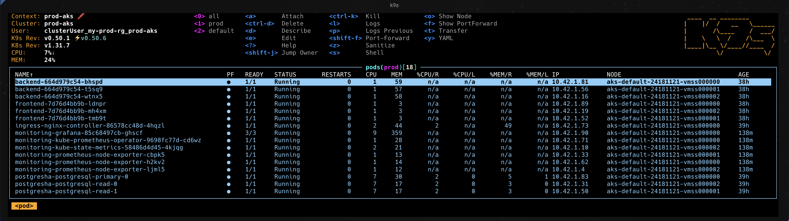

# DevOps Technical Challenge – Solution Overview

> **A modern, production-grade microservices platform on Azure AKS, built from scratch with security, automation, and best practices at its core.**
>
> This project demonstrates how to take a simple app from local development to a fully automated, observable, and resilient cloud deployment. It features rootless containers, dynamic configuration, robust health checks, high-availability PostgreSQL, modular infrastructure-as-code, and a CI/CD pipeline that validates, tests, and deploys everything with zero hardcoded secrets. Monitoring, rollback, and scalability are built in by design.

## Solution Showcase (Screenshots)

**Sample App in Browser (persistent messages):**


**Kubernetes Pods (k9s view):**



**Terragrunt CI/CD Pipeline (GitHub Actions):**


---

## 1. Application Design & Best Practices
- **Rootless, Secure Containers:** Frontend and backend run as non-root users for enhanced security.

  Example Dockerfile (real backend, rootless, from app/backend/Dockerfile):
  ```dockerfile
  FROM node:18-alpine
  WORKDIR /app
  # Create non-root user
  RUN addgroup -S demo && adduser -S demo -G demo
  # Copy package files first for better layer caching
  COPY --chown=demo:demo package.json package-lock.json ./
  # Install production deps (no devDependencies)
  RUN npm ci --only=production \
      && npm cache clean --force
  # Copy app source (with correct permissions)
  COPY --chown=demo:demo src ./src
  USER demo
  EXPOSE 3000
  CMD ["npm", "start"]
  ```
- **Dynamic Configuration:** Frontend receives backend URL via environment variable for flexible deployments.
- **Health Checks:** Backend exposes a `/health` endpoint for Kubernetes liveness/readiness probes.
- **Stateful Architecture:** PostgreSQL uses persistent storage for data durability.
- **Local Development:** `docker-compose.yml` enables local builds and tests, mirroring production dependencies.

  Example docker-compose.yml:
  ```yaml
  services:
    frontend:
      build:
        context: ../../app/frontend
        dockerfile: Dockerfile
      ports:
        - "8080:8080"
      environment:
        - BACKEND_URL=http://backend:3000
      depends_on:
        backend:
          condition: service_healthy
    backend:
      build:
        context: ../../app/backend
        dockerfile: Dockerfile
      environment:
        - PORT=3000
        - POSTGRES_CONNECTION_STRING=${POSTGRES_CONNECTION_STRING}
      depends_on:
        postgres:
          condition: service_healthy
      healthcheck:
        test: ["CMD", "node", "-e", "require('http').get('http://localhost:3000/health', res => process.exit(res.statusCode === 200 ? 0 : 1)).on('error', () => process.exit(1))"]
        interval: 10s
        timeout: 5s
        retries: 5
    postgres:
      image: postgres:15-alpine
      environment:
        - POSTGRES_USER=${POSTGRES_USER}
        - POSTGRES_PASSWORD=${POSTGRES_PASSWORD}
        - POSTGRES_DB=${POSTGRES_DB}
      volumes:
        - postgres-data:/var/lib/postgresql/data
      healthcheck:
        test: ["CMD-SHELL", "pg_isready -U ${POSTGRES_USER} -d ${POSTGRES_DB}"]
        interval: 5s
        timeout: 5s
        retries: 5
  volumes:
    postgres-data:
  ```

## 2. Kubernetes & Helm
- **Helm-Driven Deployments:** App and database are deployed via Helm charts for parameterized, repeatable deployments.
- **Local K8s Testing:** KIND is used to validate Helm charts and manifests before production.
- **Production-Grade Charts:**
  - **Postgres-HA:** 3-node cluster (1 primary, 2 replicas) for high availability.
  - **Ingress-NGINX:** Path-based routing and security headers for safe, flexible traffic management.
  - **Prometheus/Grafana:** Monitoring stack deployed via Helm, with persistent storage and secure in-cluster access.

  Example app-values.yaml:
  ```yaml
  frontend:
    image: ghcr.io/amromran102/demo/app-frontend:latest
    backendUrl: http://backend:3000
    replicaCount: 2
  backend:
    image: ghcr.io/amromran102/demo/app-backend:latest
    replicaCount: 2
    env:
      PORT: 3000
  ```

  Example frontend-deployment.yaml:
  ```yaml
  containers:
    - name: frontend
      image: {{ .Values.frontend.image }}
      imagePullPolicy: Always
      ports:
        - containerPort: 8080
      env:
        - name: BACKEND_URL
          value: {{ .Values.frontend.backendUrl }}
      readinessProbe:
        httpGet:
          path: /
          port: 8080
        initialDelaySeconds: 5
        periodSeconds: 10
      livenessProbe:
        httpGet:
          path: /
          port: 8080
        initialDelaySeconds: 10
        periodSeconds: 20
  ```

## 3. Infrastructure as Code (IaC)
- **Azure AKS as Platform:** Managed, scalable, and secure Kubernetes service.
- **Terraform Modules:** Modular, reusable code for AKS, networking, and supporting resources.
- **Terragrunt Orchestration:** Used for dependency management, DRY configuration, and safe, incremental deployments.

  Example terragrunt/live/prod/aks.hcl:
  ```hcl
  terraform {
    source = "../../terraform-modules/aks"
  }
  inputs = {
    cluster_name = "prod-aks"
    # ...other inputs...
  }
  ```

## 4. CI/CD Automation
- **Automated Workflows**
  1. **Build & Push:** GitHub Actions build and push rootless app images to GHCR, using commit SHA for traceability.
  2. **Infrastructure Provisioning:** Terragrunt workflow lints, validates, plans, and applies only affected modules.
  3. **Helm Deployments:** Helm charts are linted, validated (with kubeval), and deployed to AKS. Dynamic image tags and secure secret injection are used. Automatic deployment is triggered on new image builds or Helm chart changes.
- **Best Practices:**
  - No hardcoded secrets; all sensitive data is injected securely via GitHub Actions secrets.
  - Validation steps (Helm lint, kubeval) catch errors before deployment.
  - Conditional chart deployment for efficiency (only deploy changed components).

>
  Example pipeline (container-build-push.yaml):
  ```yaml
  jobs:
    build-and-push:
      runs-on: ubuntu-latest
      steps:
        - name: Checkout code
          uses: actions/checkout@v4
        - name: Log in to GHCR
          uses: docker/login-action@v3
          with:
            registry: ${{ env.REGISTRY }}
            username: ${{ github.actor }}
            password: ${{ secrets.GITHUB_TOKEN }}
        - name: Set up Docker Buildx
          uses: docker/setup-buildx-action@v3
        - name: Build and push frontend image
          uses: docker/build-push-action@v5
          with:
            context: app/frontend
            push: true
            tags: |
              ghcr.io/amromran102/demo/app-frontend:${{ github.sha }}
              ghcr.io/amromran102/demo/app-frontend:latest
        - name: Build and push backend image
          uses: docker/build-push-action@v5
          with:
            context: app/backend
            push: true
            tags: |
              ghcr.io/amromran102/demo/app-backend:${{ github.sha }}
              ghcr.io/amromran102/demo/app-backend:latest
  ```

  Example pipeline (helm-deploy.yml):
  ```yaml
  jobs:
    validate-config:
      name: Validate Helm Charts and Manifests
      runs-on: ubuntu-latest
      steps:
        - name: Checkout repository
          uses: actions/checkout@v4
        - name: Set up Helm
          uses: azure/setup-helm@v3
          with:
            version: 'latest'
        - name: Helm lint (all charts)
          run: |
            helm lint ./helm/app
            helm lint ./helm/bitnami-postgres
            helm lint ./helm/ingress-nginx
        - name: kubeval (rendered manifests for app only)
          run: |
            helm template ./helm/app -f ./helm/environment/prod/app-values.yaml | kubeval --strict --ignore-missing-schemas
  ```

  Example secure secret injection:
  ```yaml
  - name: Deploy App
    run: |
      helm upgrade --install sampleapp ./helm/app -n prod -f ./helm/environment/prod/app-values.yaml \
        --set frontend.image=ghcr.io/amromran102/demo/app-frontend:latest \
        --set backend.image=ghcr.io/amromran102/demo/app-backend:latest \
        --set secrets.DBconnectionString="postgresql://myuser:${{ secrets.PG_USER_PASSWORD }}@postgresha-postgresql-primary.prod.svc.cluster.local:5432/ideasdb"
  ```

  Example Terragrunt plan/apply (terragrunt-infra.yml):
  ```yaml
  - name: Terragrunt plan for affected modules
    run: |
      for dir in $AFFECTED_DIRS; do
        echo "Planning in $dir..."
        cd $dir
        terragrunt plan --non-interactive || exit 1
        cd -
      done
  - name: Terragrunt apply for affected modules
    run: |
      for dir in $AFFECTED_DIRS; do
        echo "Applying in $dir..."
        cd $dir
        terragrunt apply --non-interactive -auto-approve || exit 1
        cd -
      done
  ```

## 5. Monitoring & Observability
- **Prometheus & Grafana:** Deployed as a Helm chart with persistent storage, in-cluster access, and pre-configured Prometheus data source in Grafana.
- **Access:** Securely accessed via `kubectl port-forward` for both Prometheus and Grafana dashboards.
- **Extensible:** Ready for ServiceMonitor and custom dashboard integration for app and infra metrics.

  Example prometheus-values.yaml:
  ```yaml
  grafana:
    enabled: true
    persistence:
      enabled: true
      size: 5Gi
      storageClassName: default
    adminPassword: "admin"
    service:
      type: ClusterIP
    ingress:
      enabled: false

  prometheus:
    prometheusSpec:
      storageSpec:
        volumeClaimTemplate:
          spec:
            storageClassName: default
            accessModes: [ "ReadWriteOnce" ]
            resources:
              requests:
                storage: 10Gi
    service:
      type: ClusterIP
  ```

---